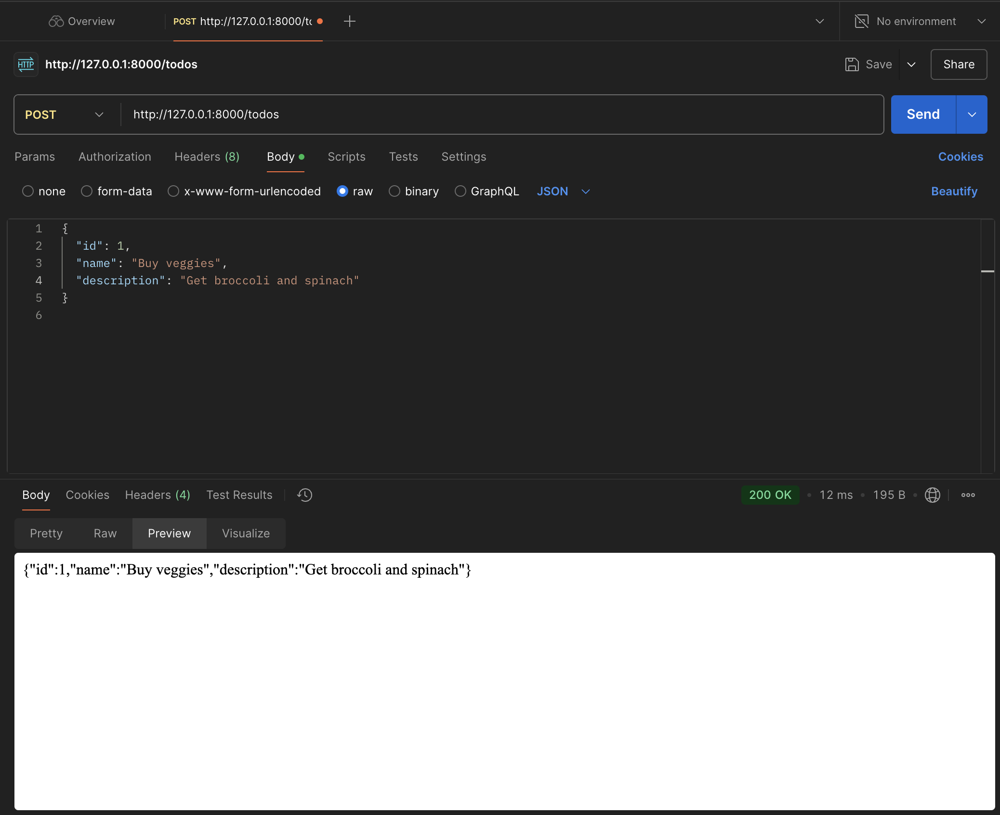

# To-Do API with FastAPI and TodoClient

This quick project demonstrates the creation of a very basic local **To-Do API** with **FastAPI** and interacting with it using a custom `TodoClient` class. A simple showcase of working with API's and SDK's.

### What We Did:
1. **FastAPI**: Built a CRUD API for managing to-do items and launched local HTTP server. 
2. **TodoClient**: Created a `TodoClient` Python client class to interact with the API. Showed how to use the client by calling `create_todo` method to create a new to-do.

Next steps would include packaging the SDK for distribution via pip and / or npm. To have the API be served in the cloud would use Digital Ocean droplets for proof of concept. 

### Postman API:
Testing API locally with Postman:

